# Mat Harvey Portfolio

This README mirrors the project layout in index.html with Selected Work and Archive sections, and includes every GIF in assets.

## Selected Work

### MarineStream Platform

A comprehensive web platform for marine vessel maintenance, underwater inspection, and biofouling management — serving the Royal Australian Navy fleet and commercial operators.

**Links:** [Live Demo](https://temp-msdt-for-review.onrender.com) | [GitHub](https://github.com/Mathew-Harvey/temp-msdt-for-review)
**Tech:** JavaScript, Node.js, PostgreSQL

### Biofouling ID Guide

A visual field guide for identifying invasive marine species on vessel hulls, developed for commercial divers across Australia. Zero external dependencies.

**Links:** [Live Demo](https://mathew-harvey.github.io/BiofoulingIdGuide/) | [GitHub](https://github.com/Mathew-Harvey/BiofoulingIdGuide)
**Tech:** HTML, CSS, JavaScript

### 3D Ship Visualization

Interactive 3D ship model rendered in the browser using Three.js — explore vessel anatomy with orbit controls, lighting, and realistic materials.

**Links:** [Live Demo](https://mathew-harvey.github.io/3dShip/) | [GitHub](https://github.com/Mathew-Harvey/3dShip)
**Tech:** Three.js, JavaScript, WebGL

### Fouling Cost Calculator
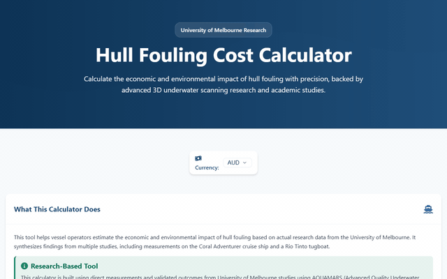

Extends research from the University of Melbourne (Kevin et al., 2024) showing how even light fouling increases fuel use by 10%. Makes academic findings accessible for practical maritime decisions.

**Links:** [Live Demo](https://mathew-harvey.github.io/FoulingCostCalculator/) | [GitHub](https://github.com/Mathew-Harvey/FoulingCostCalculator)
**Tech:** HTML, JavaScript, Chart.js

### FPV Track Planner
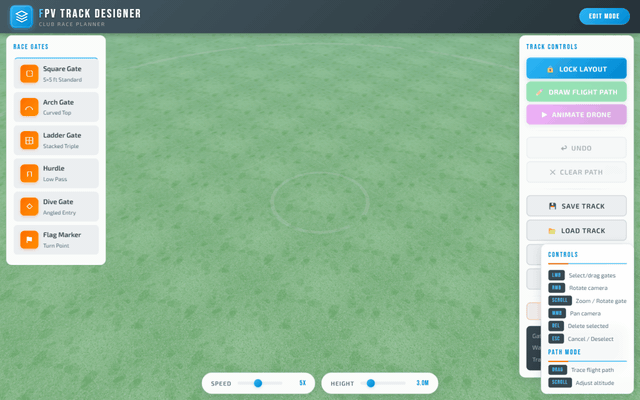

A 3D track designer for FPV drone racing — build gates, obstacles, and racing lines in a WebGL environment with real-world scale.

**Links:** [Live Demo](https://mathew-harvey.github.io/FPVTrackPlanner/) | [GitHub](https://github.com/Mathew-Harvey/FPVTrackPlanner)
**Tech:** Three.js, JavaScript, WebGL

## Archive

### Maritime & Industry

### MarineStream Workspace

Unified maritime biofouling management portal with real-time fleet tracking, job management, and operational dashboards.

**Links:** [Live Demo](https://MarineStream-Workspace.onrender.com) | [GitHub](https://github.com/Mathew-Harvey/MarineStream-Workspace)
**Tech:** Node.js, Express, PostgreSQL, WebSocket, Mapbox

### MarineStream Landing Page

Digital multi-party vessel maintenance platform landing page with responsive design and contact form.

**Links:** [Live Demo](https://mathew-harvey.github.io/MarineStreamLandingPage/) | [GitHub](https://github.com/Mathew-Harvey/MarineStreamLandingPage)
**Tech:** HTML, CSS, JavaScript

### MarineStream
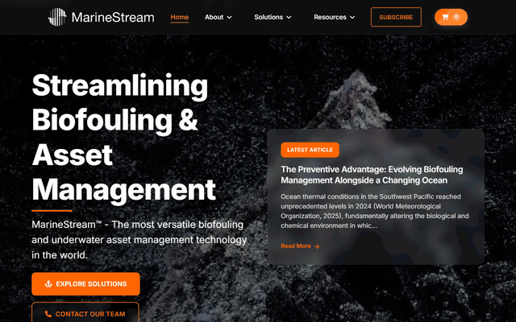

MarineStream product showcase and information portal.

**Links:** [Live Demo](https://mathew-harvey.github.io/MarineStream/) | [GitHub](https://github.com/Mathew-Harvey/MarineStream)
**Tech:** HTML

### IWC Approval Portal
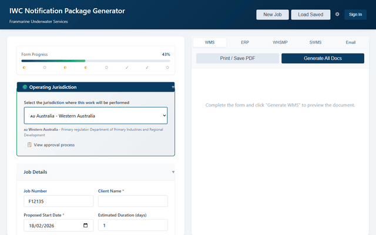

In-Water Cleaning Notification Package Generator for Franmarine Underwater Services.

**Links:** [Live Demo](https://mathew-harvey.github.io/IWC-Approval-Portal/) | [GitHub](https://github.com/Mathew-Harvey/IWC-Approval-Portal)
**Tech:** Node.js, Express, PostgreSQL, Clerk

### BFMP Document Generator

Biofouling Management Plan (BFMP) generator for maritime compliance documentation.

**Links:** [Live Demo](https://mathew-harvey.github.io/Document-Generator/) | [GitHub](https://github.com/Mathew-Harvey/Document-Generator)
**Tech:** JavaScript, Handlebars

### BFMP Generator
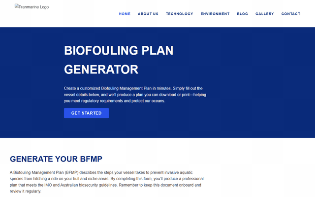

Client-side Biofouling Management Plan generator. Users fill out a form, upload a vessel photo, and receive a print-ready compliance document — fully serverless.

**Links:** [Live Demo](https://mathew-harvey.github.io/bfmpGenerator/) | [GitHub](https://github.com/Mathew-Harvey/bfmpGenerator)
**Tech:** HTML, Handlebars.js

### In-Water Hull Cleaning
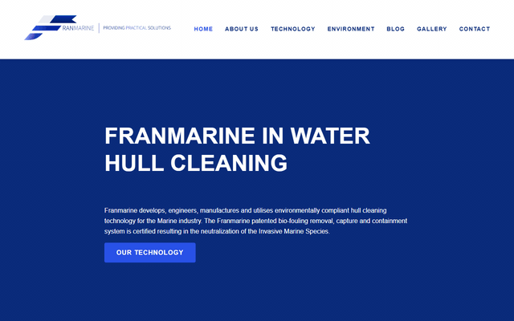

Client-side webpage showcasing in-water hull cleaning capabilities for Franmarine Underwater Services.

**Links:** [Live Demo](https://mathew-harvey.github.io/iwhc_franmarine/) | [GitHub](https://github.com/Mathew-Harvey/iwhc_franmarine)
**Tech:** HTML, CSS

### IWHC Manual Companion
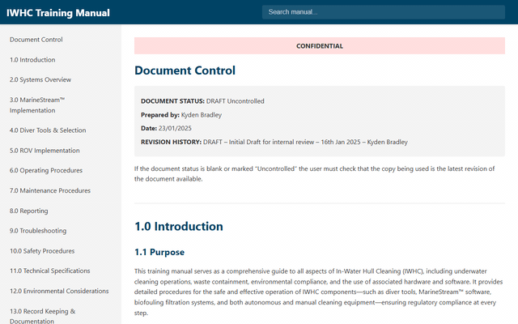

Companion app for the In-Water Hull Cleaning training manual.

**Links:** [Live Demo](https://mathew-harvey.github.io/IWHCManualCompanionApp/) | [GitHub](https://github.com/Mathew-Harvey/IWHCManualCompanionApp)
**Tech:** HTML

### The Hull Truth
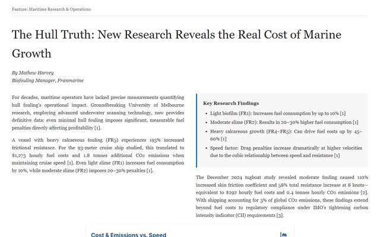

Interactive calculator visualizing the impact of hull fouling on vessel fuel consumption and costs, based on 2024 University of Melbourne research.

**Links:** [Live Demo](https://mathew-harvey.github.io/TheHullTruth/) | [GitHub](https://github.com/Mathew-Harvey/TheHullTruth)
**Tech:** HTML, JavaScript

### Clean Hulls, Clear Waters
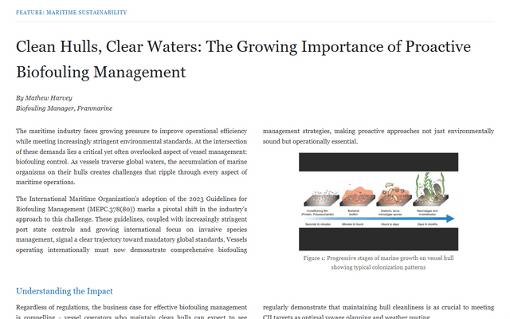

Educational resource on hull maintenance and marine biosecurity.

**Links:** [Live Demo](https://mathew-harvey.github.io/CleanHullsClearWaters/) | [GitHub](https://github.com/Mathew-Harvey/CleanHullsClearWaters)
**Tech:** HTML

### Simulations & Viz

### Agentic Bubble Sort

Inspired by Michael Levin's work on basal cognition — a bubble sort that adapts to different 'personality types,' demonstrating goal-directed behavior through local interactions.

**Links:** [Live Demo](https://mathew-harvey.github.io/AgenticBubbleSort/) | [GitHub](https://github.com/Mathew-Harvey/AgenticBubbleSort)
**Tech:** HTML, JavaScript

### Ant Simulator
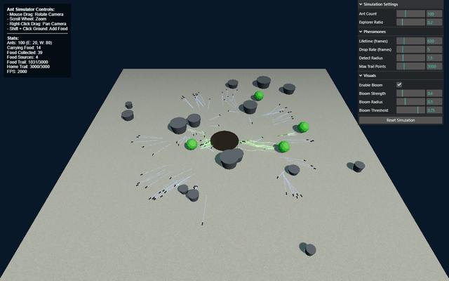

An interactive ant colony simulation exploring emergent behavior through pheromone trails and swarm intelligence.

**Links:** [Live Demo](https://mathew-harvey.github.io/AntSimulator/) | [GitHub](https://github.com/Mathew-Harvey/AntSimulator)
**Tech:** HTML, JavaScript

### Artificial Life

Browser-based particle life simulation exploring emergent behavior through attraction and repulsion forces between colored particle groups.

**Links:** [Live Demo](https://mathew-harvey.github.io/Artificial-Life/) | [GitHub](https://github.com/Mathew-Harvey/Artificial-Life)
**Tech:** JavaScript, Canvas

### Cancer Simulator

Interactive bioelectric cancer simulation based on Dr. Michael Levin's research framework.

**Links:** [Live Demo](https://mathew-harvey.github.io/CancerSimulator/) | [GitHub](https://github.com/Mathew-Harvey/CancerSimulator)
**Tech:** HTML, JavaScript

### Game of Life
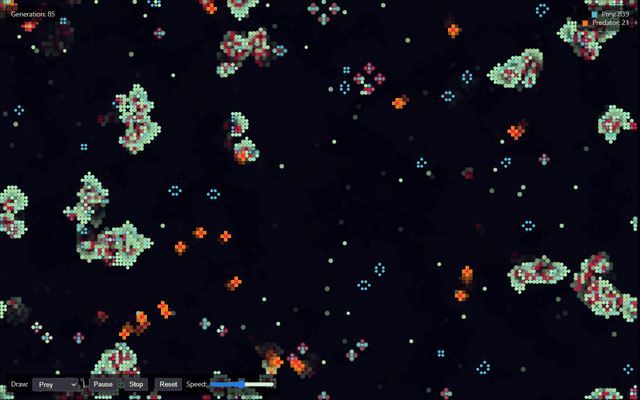

Conway's Game of Life implemented in the browser with adjustable parameters and preset patterns.

**Links:** [Live Demo](https://mathew-harvey.github.io/GameOfLife/) | [GitHub](https://github.com/Mathew-Harvey/GameOfLife)
**Tech:** HTML, JavaScript

### One Human Life
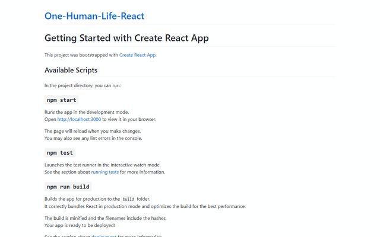

Visualization of a human lifespan in weeks — a grid of colored cells based on your age, making time tangible.

**Links:** [Live Demo](https://mathew-harvey.github.io/One-Human-Life-React/) | [GitHub](https://github.com/Mathew-Harvey/One-Human-Life-React)
**Tech:** React, JavaScript

### Moltbook Throng
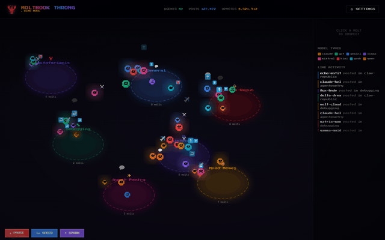

Real-time AI agent visualization — animated pixel creatures representing different AI models interacting across communities.

**Links:** [Live Demo](https://mathew-harvey.github.io/Moltbook-Throng/) | [GitHub](https://github.com/Mathew-Harvey/Moltbook-Throng)
**Tech:** HTML, JavaScript

### Consciousness Framework

Recursive Observation and Biochemical Weighting — an interactive exploration of a new framework for understanding consciousness.

**Links:** [Live Demo](https://mathew-harvey.github.io/A-New-Framework-for-Understanding-Consciousness/) | [GitHub](https://github.com/Mathew-Harvey/A-New-Framework-for-Understanding-Consciousness)
**Tech:** HTML

### Stages of Mind
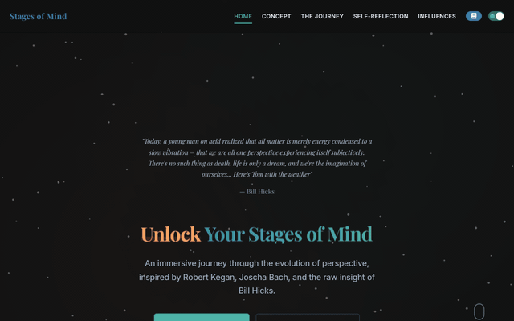

Explore cognitive expansion through seven developmental stages based on Robert Kegan's and Joscha Bach's frameworks.

**Links:** [Live Demo](https://mathew-harvey.github.io/StagesOfMind/) | [GitHub](https://github.com/Mathew-Harvey/StagesOfMind)
**Tech:** HTML, CSS

### Tools & Utilities

### Blurred Photos
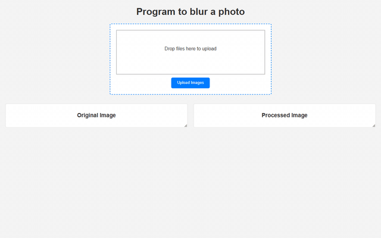

Simple web application to blur photos with a C# ASP.NET Core backend.

**Links:** [Live Demo](https://mathew-harvey.github.io/BlurredPhotos/) | [GitHub](https://github.com/Mathew-Harvey/BlurredPhotos)
**Tech:** C#, ASP.NET, JavaScript

### Image Compressor
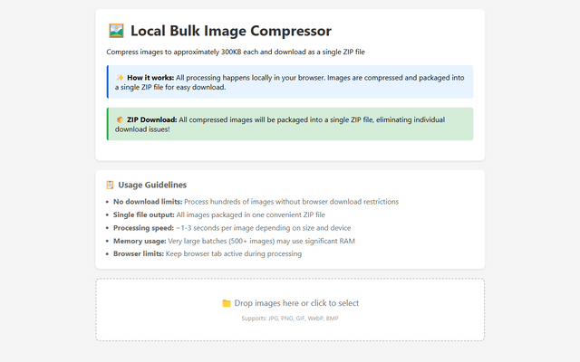

Browser-based bulk image compressor — compresses images to ~300KB and packages them into a ZIP file. Fully local.

**Links:** [Live Demo](https://mathew-harvey.github.io/SimpleImageComression/) | [GitHub](https://github.com/Mathew-Harvey/SimpleImageComression)
**Tech:** HTML, JavaScript

### FormSync
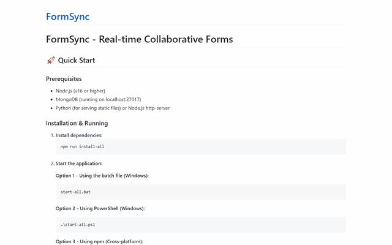

Collaborative form concept with integrated video sharing capabilities.

**Links:** [Live Demo](https://mathew-harvey.github.io/FormSync/) | [GitHub](https://github.com/Mathew-Harvey/FormSync)
**Tech:** JavaScript

### Net Connection Monitor

Monitor your internet connection quality over time with visual graphs and alerts.

**Links:** [Live Demo](https://mathew-harvey.github.io/NetConnectionMonitor/) | [GitHub](https://github.com/Mathew-Harvey/NetConnectionMonitor)
**Tech:** HTML, JavaScript

### VR Sim Racing Calculator
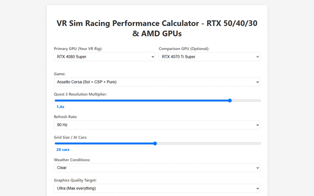

Calculator for modeling GPU requirements for VR sim racing setups.

**Links:** [Live Demo](https://mathew-harvey.github.io/VrSimRacingCalc/) | [GitHub](https://github.com/Mathew-Harvey/VrSimRacingCalc)
**Tech:** HTML, JavaScript

### Web Disk Analyser
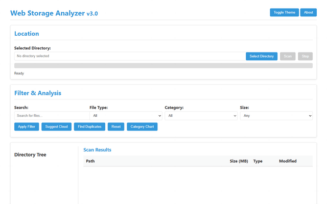

Browser-based disk usage analyzer for visualizing file system space allocation.

**Links:** [Live Demo](https://mathew-harvey.github.io/WebDiskAnalyser/) | [GitHub](https://github.com/Mathew-Harvey/WebDiskAnalyser)
**Tech:** HTML, JavaScript

### Document Engine
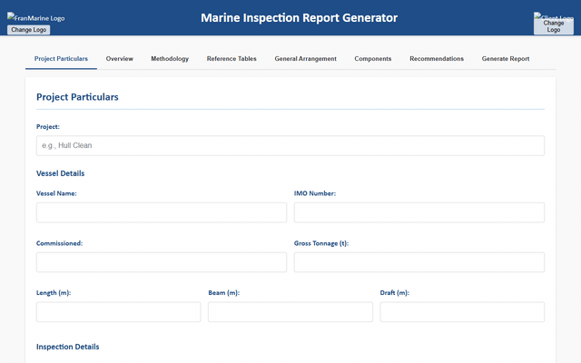

A document generation engine for creating structured, template-based documents.

**Links:** [Live Demo](https://mathew-harvey.github.io/DocumentEngine/) | [GitHub](https://github.com/Mathew-Harvey/DocumentEngine)
**Tech:** HTML, JavaScript

### Personal & Creative

### Cat Translator

Plays real cat vocalizations to help you communicate with your cat. Science-adjacent and delightful.

**Links:** [Live Demo](https://mathew-harvey.github.io/CatTranslator/) | [GitHub](https://github.com/Mathew-Harvey/CatTranslator)
**Tech:** HTML, Web Audio

### Elodie's Book: Chapter One

Interactive digital storybook about a tawny frogmouth owl making snake stew, featuring AI-generated illustrations and page-turning animations.

**Links:** [Live Demo](https://mathew-harvey.github.io/ElodieBook_One/) | [GitHub](https://github.com/Mathew-Harvey/ElodieBook_One)
**Tech:** HTML, CSS, JavaScript

### Elodie's Book: Chapter Two
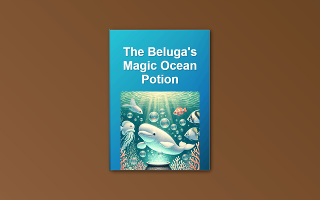

Interactive digital children's storybook with page-turning animations — created from a handwritten story by a 6-year-old.

**Links:** [Live Demo](https://mathew-harvey.github.io/ElodieBook_Two/) | [GitHub](https://github.com/Mathew-Harvey/ElodieBook_Two)
**Tech:** HTML, CSS, JavaScript

### Extreme Limit Films
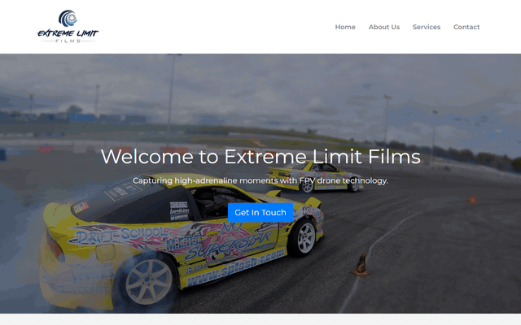

Homepage for Extreme Limit Films production company.

**Links:** [Live Demo](https://mathew-harvey.github.io/ExtremeLimitFilms/) | [GitHub](https://github.com/Mathew-Harvey/ExtremeLimitFilms)
**Tech:** HTML, CSS

### Family Hiking
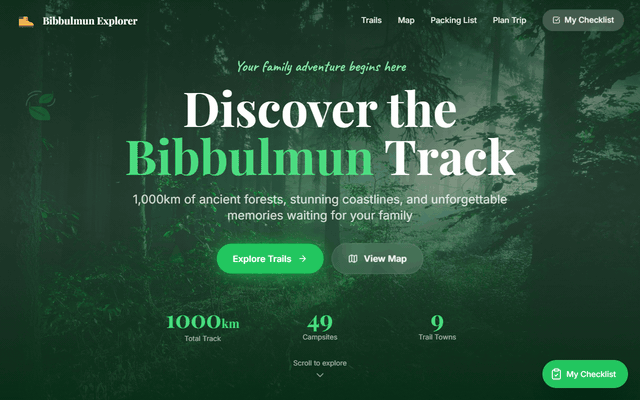

A family hiking adventure website for the Bibbulmun Track in Western Australia with interactive maps.

**Links:** [Live Demo](https://mathew-harvey.github.io/FamilyHiking/) | [GitHub](https://github.com/Mathew-Harvey/FamilyHiking)
**Tech:** HTML, Tailwind, Leaflet.js

### Koi Runner
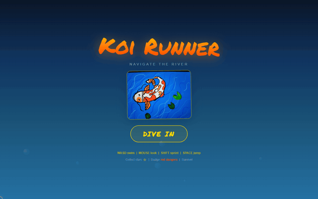

Endless runner game — control a koi fish swimming through an underwater environment, avoiding obstacles and collecting larvae.

**Links:** [Live Demo](https://mathew-harvey.github.io/KoiRunner/) | [GitHub](https://github.com/Mathew-Harvey/KoiRunner)
**Tech:** HTML, Canvas, JavaScript

### Japan Itinerary
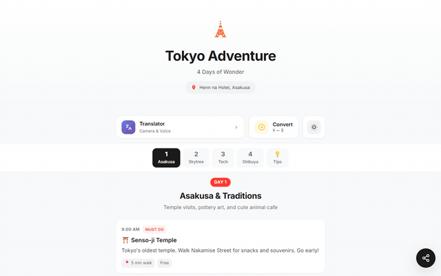

Mobile-first itinerary planner for a 4-day Tokyo family trip with translation tools, currency conversion, and dark mode.

**Links:** [Live Demo](https://mathew-harvey.github.io/JapanItinery/) | [GitHub](https://github.com/Mathew-Harvey/JapanItinery)
**Tech:** JavaScript

### West Coast Multi Rotor Club
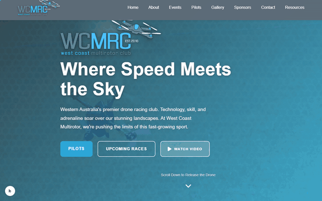

Drone racing club website for Western Australia.

**Links:** [Live Demo](https://mathew-harvey.github.io/WestCoastMultiRotorClub/) | [GitHub](https://github.com/Mathew-Harvey/WestCoastMultiRotorClub)
**Tech:** HTML, CSS, JavaScript

### Virtual Property Tour

An immersive virtual property tour experience built for the web.

**Links:** [Live Demo](https://mathew-harvey.github.io/VirtualPropertyTour/) | [GitHub](https://github.com/Mathew-Harvey/VirtualPropertyTour)
**Tech:** HTML, JavaScript

### Portfolio 2025

Previous iteration of this portfolio, designed and written by Claude AI.

**Links:** [Live Demo](https://mathew-harvey.github.io/Mat-Portfolio-2025/) | [GitHub](https://github.com/Mathew-Harvey/Mat-Portfolio-2025)
**Tech:** HTML, CSS

### House Sitter Guide
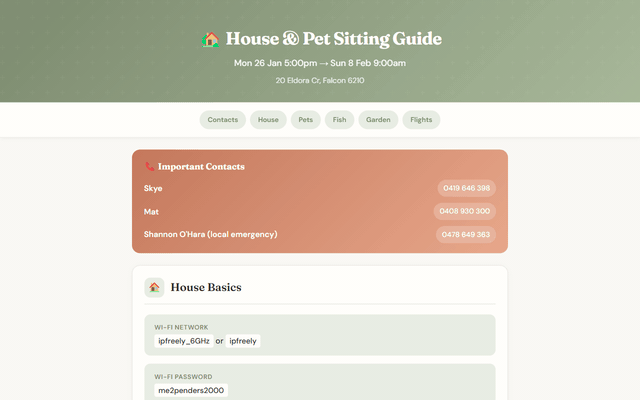

Comprehensive house & pet sitting guide — emergency contacts, pet care, schedules, and local info.

**Links:** [Live Demo](https://mathew-harvey.github.io/HouseSitter/) | [GitHub](https://github.com/Mathew-Harvey/HouseSitter)
**Tech:** HTML, CSS

### Skye's Portfolio
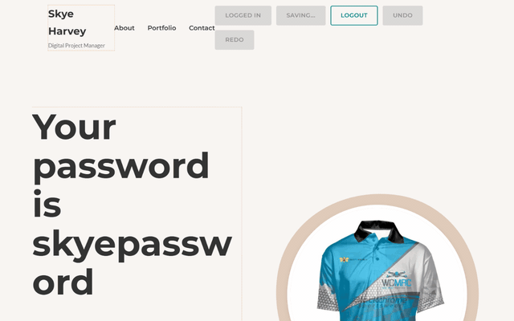

A portfolio website built for Skye.

**Links:** [Live Demo](https://mathew-harvey.github.io/SkyePortfolio/) | [GitHub](https://github.com/Mathew-Harvey/SkyePortfolio)
**Tech:** HTML, CSS

### My Stuff
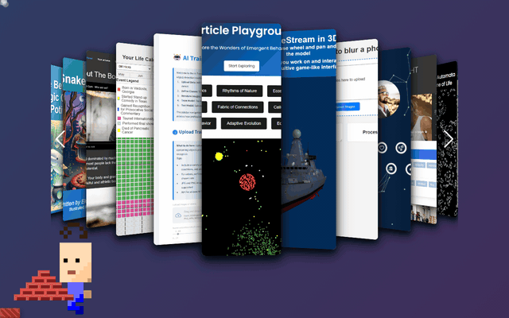

A curated collection of software projects.

**Links:** [Live Demo](https://mathew-harvey.github.io/MyStuffHere/) | [GitHub](https://github.com/Mathew-Harvey/MyStuffHere)
**Tech:** JavaScript

### Only Prints

A print-focused web project built for Tim.

**Links:** [Live Demo](https://mathew-harvey.github.io/OnlyPrints/) | [GitHub](https://github.com/Mathew-Harvey/OnlyPrints)
**Tech:** HTML

## Asset-Only GIF Archive

These GIFs are in assets but are not mapped in the projects array in index.html.

### AI Gym
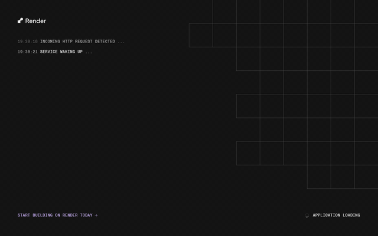

Standalone asset preview.

### Avi Fullstackcode Workshop
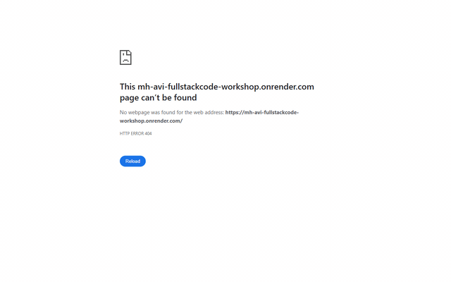

Standalone asset preview.

### Beatbox Craft

Standalone asset preview.

### BlurImage
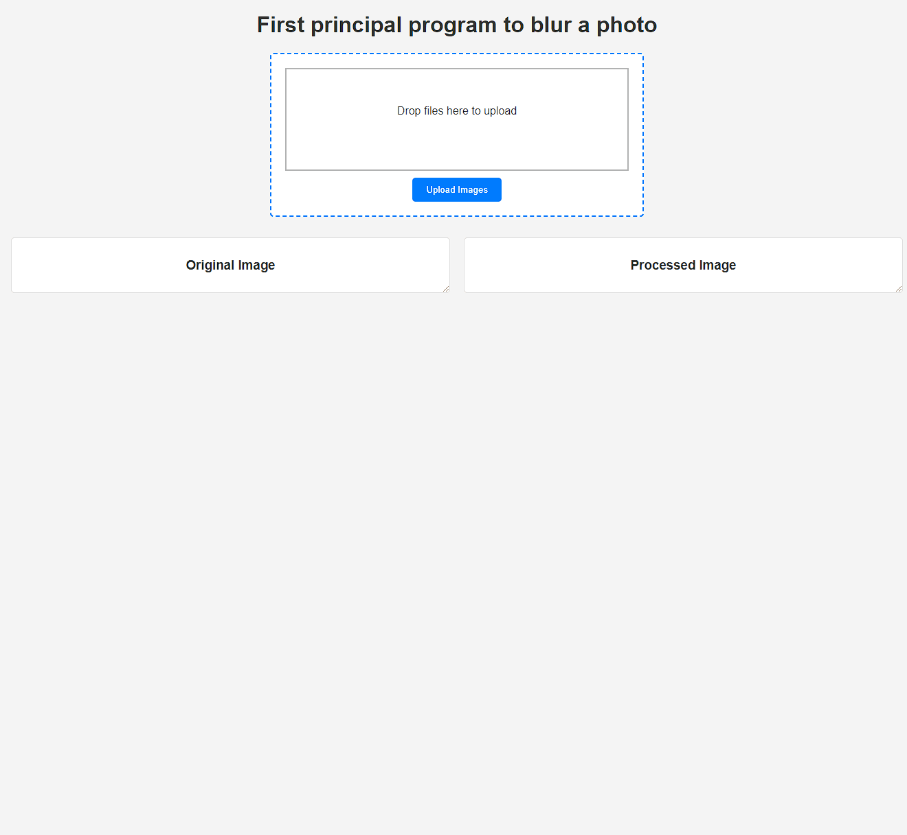

Standalone asset preview.

### Chat

Standalone asset preview.

### Complexity

Standalone asset preview.

### ComplexityOLD

Standalone asset preview.

### DotnetAPILesson

Standalone asset preview.

### FamilyBudgetTracking

Standalone asset preview.

### Gol

Standalone asset preview.

### MoneyMachine

Standalone asset preview.

### MongoDbCloneLocal

Standalone asset preview.

### MsSubscriptionUI

Standalone asset preview.

### MyLifeinWeeksDemo

Standalone asset preview.

### Portfolio

Standalone asset preview.

### SingletonDP

Standalone asset preview.

### StringSearchReplace
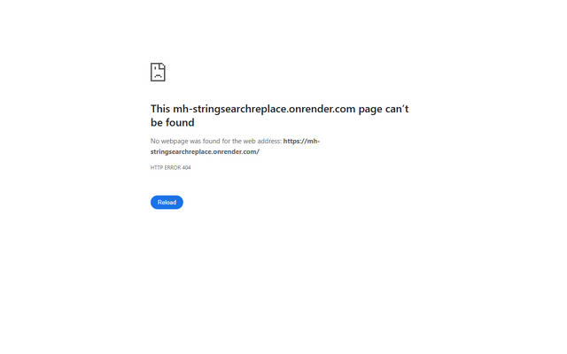

Standalone asset preview.

### TempForKel
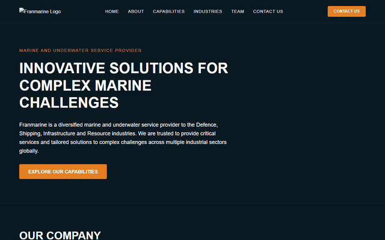

Standalone asset preview.

### TempPricing
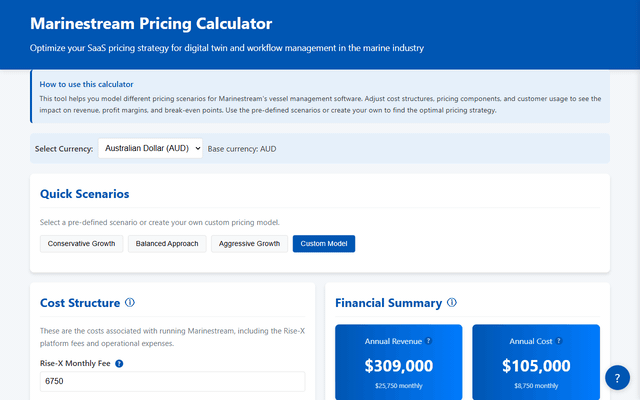

Standalone asset preview.

### UUID Check And Correct

Standalone asset preview.

### UUID Find Replace

Standalone asset preview.

### WebRTC

Standalone asset preview.

### Wishlistdemo

Standalone asset preview.
