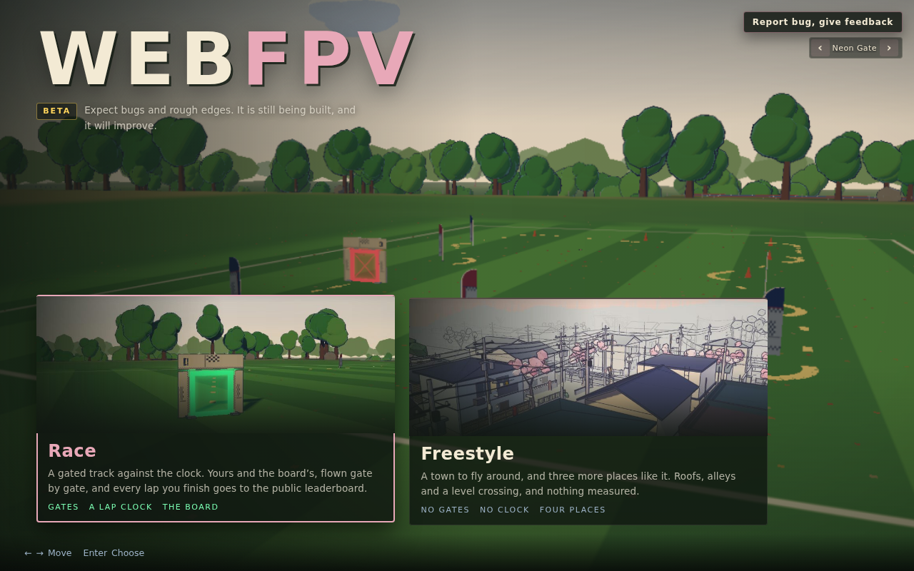
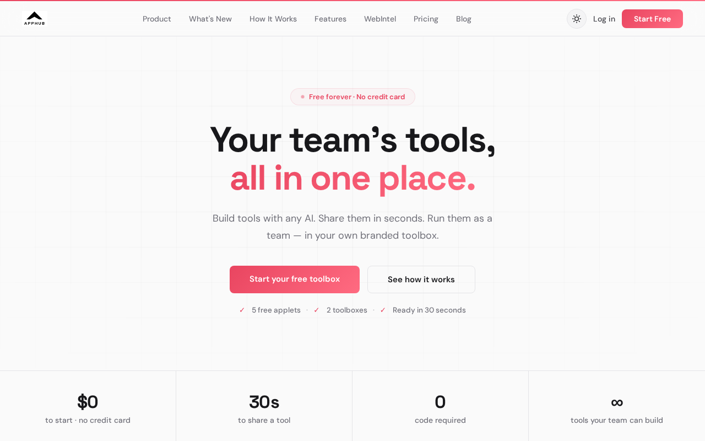
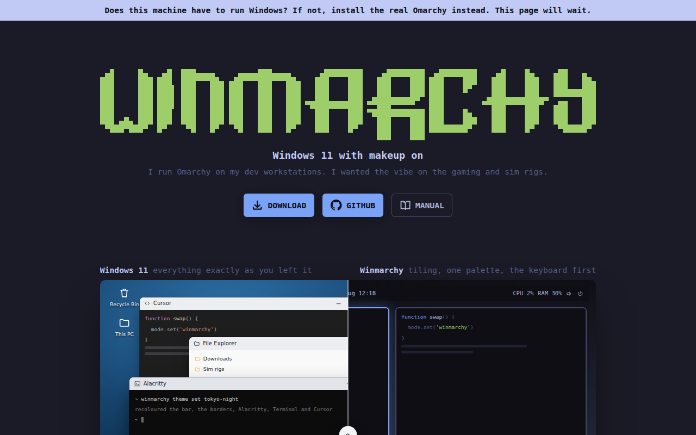
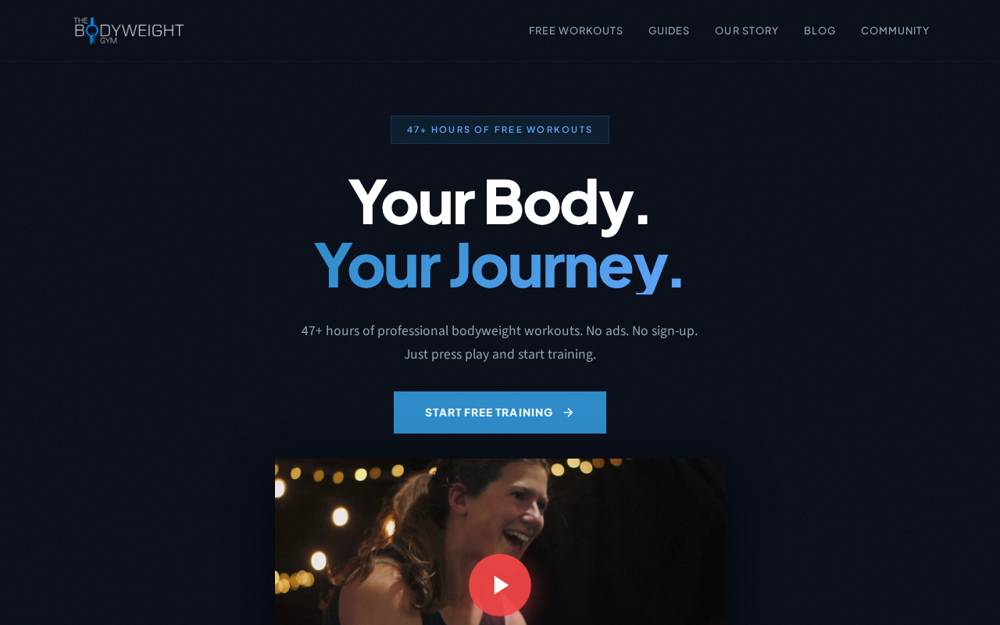

# Mat Harvey

### Data Scientist | Software Engineer | Marine Scientist

Scientist first, developer since. Marine science taught me to distrust a number until I know how it was measured, data science taught me what to do with it once I do, and software engineering is how it reaches anybody else.
I build systems that turn messy operational reality into software people actually trust.
I use AI heavily as a tool. It does not do the thinking for me.

---

## Live

Four of these have their own domain, their own users and their own uptime to worry about. Everything further down is the workbench they came out of.

<table>
<tr>
<td width="50%" valign="top">
<h3>WebFPV <a href="https://webfpv.org" target="_blank">webfpv.org</a></h3>

<em>"A five inch racing quad, built in front of you."</em>

A browser FPV racing simulator that does not approximate the flight controller, it runs it. Betaflight 4.5.1 is compiled to WebAssembly and the real control loop ticks at 1 kHz against fixed timestep physics, so a dropped frame changes nothing about where you end up. Race a gated track against the clock and every lap you finish goes to the public leaderboard, or fly freestyle around a town and three other places with nothing measured. Build your own course in the plan view at published MultiGP gate dimensions, watch it stand up in 3D, then fly it. Free, no install, no account.

<strong>Links:</strong> <a href="https://webfpv.org" target="_blank">Live Site</a> | <a href="https://github.com/Mathew-Harvey/WebFPVSimulator" target="_blank">Simulator</a> | <a href="https://github.com/Mathew-Harvey/WebFPVSimulator-LeaderBoard" target="_blank">Leaderboard</a>

<strong>Tech:</strong> WebAssembly | Betaflight | Three.js | WebGL | Node | Postgres

</td>
<td width="50%" valign="top">
<h3>AppHub <a href="https://my-app-hub.com" target="_blank">my-app-hub.com</a></h3>

<em>"Your team's tools, all in one place."</em>

The answer to a problem every team now has: people build genuinely useful little tools with AI, and then those tools die in a chat log. Drop the file in, whatever it is, and it becomes a sandboxed applet in your company's own branded toolbox, with real time collaboration, version history and an audit trail. No deploy pipeline, no IT ticket, and still accountable on Friday.

<strong>Links:</strong> <a href="https://my-app-hub.com" target="_blank">Live Site</a>

<strong>Tech:</strong> Node | PostgreSQL | Sandboxed iframes

</td>
</tr>
<tr>
<td width="50%" valign="top">
<h3>Winmarchy <a href="https://winmarchy.org" target="_blank">winmarchy.org</a></h3>

<em>"Windows 11 with makeup on."</em>

I run Omarchy on my dev workstations and wanted the same tiling, keyboard first desktop on the machines that are stuck on Windows: anti cheat, a wheelbase whose only driver is an exe from 2019, a work laptop with a policy bolted to it. Eight themes, one palette across the bar, the borders and the terminal, and one hotkey back to plain Windows when something needs it.

<strong>Links:</strong> <a href="https://winmarchy.org" target="_blank">Live Site</a> | <a href="https://github.com/Mathew-Harvey/WinOmarchy" target="_blank">GitHub</a>

<strong>Tech:</strong> .NET 8 | GlazeWM | PowerShell | winget

</td>
<td width="50%" valign="top">
<h3>The Bodyweight Gym <a href="https://thebodyweightgym.org" target="_blank">thebodyweightgym.org</a></h3>

<em>"Your Body. Your Journey."</em>

47+ hours of professional bodyweight classes across strength, mobility and skills, given away. No ads, no sign up, no email harvested on the way in. The paid guides, ring muscle up and handstand, are the only thing behind a price, and each ships with its own progress tracking app.

<strong>Links:</strong> <a href="https://thebodyweightgym.org" target="_blank">Live Site</a> | <a href="https://github.com/Mathew-Harvey/TheBodyweightGymOnline2025" target="_blank">GitHub</a>

<strong>Tech:</strong> HTML | JavaScript | Node | Render

</td>
</tr>
</table>

---

