

# Mat Harvey

### Data Scientist | Software Engineer | Marine Scientist

Scientist first, developer since. Marine science taught me to distrust a number until I know how it was measured, data science taught me what to do with it once I do, and software engineering is how it reaches anybody else.
I build systems that turn messy operational reality into software people actually trust.
I use AI heavily as a tool. It does not do the thinking for me.

My day job is data and software. What follows is the personal side of the workbench: data pipelines, simulations, visualisations, small tools, and a couple of things made for my kids.

---

## Live

Four of these have their own domain, their own users and their own uptime to worry about. Everything further down is the workbench they came out of.

<table>
<tr>
<td width="50%" valign="top">
<h3>WebFPV <a href="https://webfpv.org" target="_blank">webfpv.org</a></h3>

<em>"A five inch racing quad, built in front of you."</em>

A browser FPV racing simulator that does not approximate the flight controller, it runs it. Betaflight 4.5.1 is compiled to WebAssembly and the real control loop ticks at 1 kHz against fixed timestep physics, so a dropped frame changes nothing about where you end up. Race a gated track against the clock and every lap you finish goes to the public leaderboard, or fly freestyle around a town and three other places with nothing measured. Build your own course in the plan view at published MultiGP gate dimensions, watch it stand up in 3D, then fly it. Free, no install, no account.

<strong>Links:</strong> <a href="https://webfpv.org" target="_blank">Live Site</a> | <a href="https://github.com/Mathew-Harvey/WebFPVSimulator" target="_blank">Simulator</a> | <a href="https://github.com/Mathew-Harvey/WebFPVSimulator-LeaderBoard" target="_blank">Leaderboard</a>

<strong>Tech:</strong> WebAssembly | Betaflight | Three.js | WebGL | Node | Postgres

</td>
<td width="50%" valign="top">
<h3>AppHub <a href="https://my-app-hub.com" target="_blank">my-app-hub.com</a></h3>

<em>"Your team's tools, all in one place."</em>

The answer to a problem every team now has: people build genuinely useful little tools with AI, and then those tools die in a chat log. Drop the file in, whatever it is, and it becomes a sandboxed applet in your company's own branded toolbox, with real time collaboration, version history and an audit trail. No deploy pipeline, no IT ticket, and still accountable on Friday.

<strong>Links:</strong> <a href="https://my-app-hub.com" target="_blank">Live Site</a>

<strong>Tech:</strong> Node | PostgreSQL | Sandboxed iframes

</td>
</tr>
<tr>
<td width="50%" valign="top">
<h3>Winmarchy <a href="https://winmarchy.org" target="_blank">winmarchy.org</a></h3>

<em>"Windows 11 with makeup on."</em>

I run Omarchy on my dev workstations and wanted the same tiling, keyboard first desktop on the machines that are stuck on Windows: anti cheat, a wheelbase whose only driver is an exe from 2019, a work laptop with a policy bolted to it. Eight themes, one palette across the bar, the borders and the terminal, and one hotkey back to plain Windows when something needs it.

<strong>Links:</strong> <a href="https://winmarchy.org" target="_blank">Live Site</a> | <a href="https://github.com/Mathew-Harvey/WinOmarchy" target="_blank">GitHub</a>

<strong>Tech:</strong> .NET 8 | GlazeWM | PowerShell | winget

</td>
<td width="50%" valign="top">
<h3>The Bodyweight Gym <a href="https://thebodyweightgym.org" target="_blank">thebodyweightgym.org</a></h3>

<em>"Your Body. Your Journey."</em>

47+ hours of professional bodyweight classes across strength, mobility and skills, given away. No ads, no sign up, no email harvested on the way in. The paid guides, ring muscle up and handstand, are the only thing behind a price, and each ships with its own progress tracking app.

<strong>Links:</strong> <a href="https://thebodyweightgym.org" target="_blank">Live Site</a> | <a href="https://github.com/Mathew-Harvey/TheBodyweightGymOnline2025" target="_blank">GitHub</a>

<strong>Tech:</strong> HTML | JavaScript | Node | Render

</td>
</tr>
</table>

---

## Selected Work

<table>
<tr>
<td width="50%" valign="top">
<h3>Agentic Bubble Sort</h3>
<a href="https://mathew-harvey.github.io/AgenticBubbleSort/" target="_blank">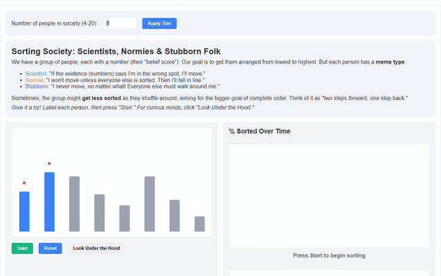</a>

Inspired by Michael Levin's work on basal cognition. A bubble sort where each element is given a "personality", producing goal-directed behaviour from nothing but local interactions.

<strong>Links:</strong> <a href="https://mathew-harvey.github.io/AgenticBubbleSort/" target="_blank">Live Demo</a> | <a href="https://github.com/Mathew-Harvey/AgenticBubbleSort" target="_blank">GitHub</a>

<strong>Tech:</strong> HTML | JavaScript

</td>
<td width="50%" valign="top">
<h3>FPV Track Planner</h3>
<a href="https://mathew-harvey.github.io/FPVTrackPlanner/" target="_blank">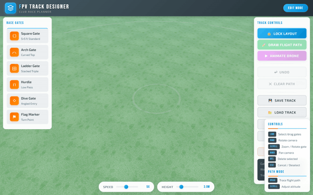</a>

A 3D track designer for FPV drone racing. Build gates, obstacles and racing lines in a WebGL environment at real-world scale.

<strong>Links:</strong> <a href="https://mathew-harvey.github.io/FPVTrackPlanner/" target="_blank">Live Demo</a> | <a href="https://github.com/Mathew-Harvey/FPVTrackPlanner" target="_blank">GitHub</a>

<strong>Tech:</strong> Three.js | JavaScript | WebGL

</td>
</tr>
<tr>
<td width="50%" valign="top">
<h3>Artificial Life</h3>
<a href="https://mathew-harvey.github.io/Artificial-Life/" target="_blank">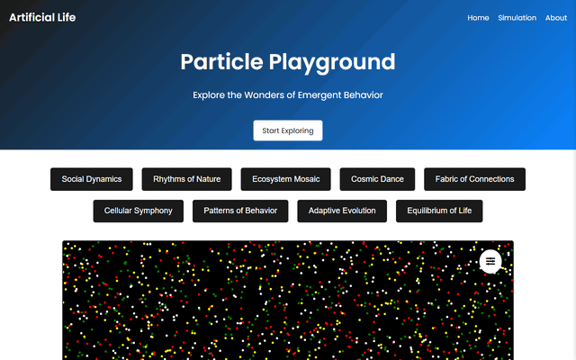</a>

Browser-based particle life simulation exploring emergent behaviour through attraction and repulsion forces between coloured particle groups.

<strong>Links:</strong> <a href="https://mathew-harvey.github.io/Artificial-Life/" target="_blank">Live Demo</a> | <a href="https://github.com/Mathew-Harvey/Artificial-Life" target="_blank">GitHub</a>

<strong>Tech:</strong> JavaScript | Canvas

</td>
<td width="50%" valign="top">
<h3>Net Connection Monitor</h3>

Monitors internet connection quality over time with visual graphs and alerts. Built because I wanted evidence, not a hunch, about when the line was dropping.

<strong>Links:</strong> <a href="https://mathew-harvey.github.io/NetConnectionMonitor/" target="_blank">Live Demo</a> | <a href="https://github.com/Mathew-Harvey/NetConnectionMonitor" target="_blank">GitHub</a>

<strong>Tech:</strong> HTML | JavaScript

</td>
</tr>
</table>

---

## Simulations and Visualisation

<table>
<tr>
<td width="50%" valign="top">
<h3>Complexity</h3>

A visual exploration of complexity and emergent structure in the browser.

<strong>Links:</strong> <a href="https://mathew-harvey.github.io/complexity/" target="_blank">Live Demo</a>

<strong>Tech:</strong> HTML | JavaScript

</td>
<td width="50%" valign="top">
<h3>Ant Simulator</h3>
<a href="https://mathew-harvey.github.io/AntSimulator/" target="_blank">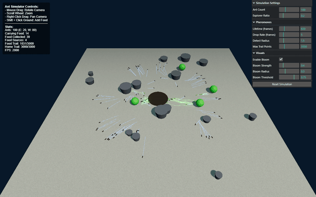</a>

An interactive ant colony simulation exploring emergent behaviour through pheromone trails and swarm intelligence.

<strong>Links:</strong> <a href="https://mathew-harvey.github.io/AntSimulator/" target="_blank">Live Demo</a> | <a href="https://github.com/Mathew-Harvey/AntSimulator" target="_blank">GitHub</a>

<strong>Tech:</strong> HTML | JavaScript

</td>
</tr>
<tr>
<td width="50%" valign="top">
<h3>Cancer Simulator</h3>
<a href="https://mathew-harvey.github.io/CancerSimulator/" target="_blank">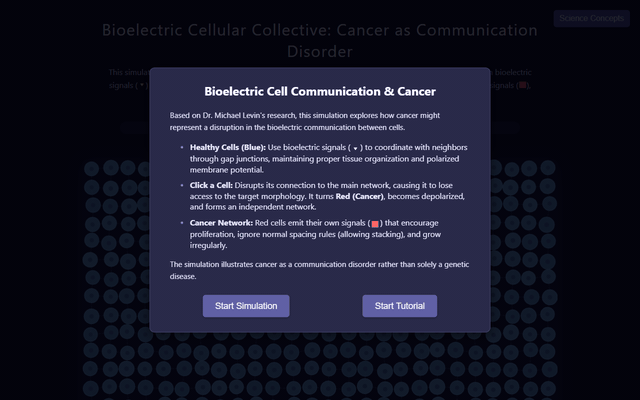</a>

Interactive bioelectric cancer simulation based on Dr Michael Levin's research framework.

<strong>Links:</strong> <a href="https://mathew-harvey.github.io/CancerSimulator/" target="_blank">Live Demo</a> | <a href="https://github.com/Mathew-Harvey/CancerSimulator" target="_blank">GitHub</a>

<strong>Tech:</strong> HTML | JavaScript

</td>
<td width="50%" valign="top">
<h3>Game of Life</h3>
<a href="https://mathew-harvey.github.io/GameOfLife/" target="_blank">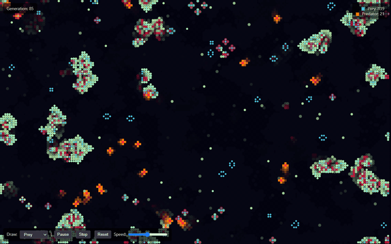</a>

Conway's Game of Life implemented in the browser with adjustable parameters and preset patterns.

<strong>Links:</strong> <a href="https://mathew-harvey.github.io/GameOfLife/" target="_blank">Live Demo</a> | <a href="https://github.com/Mathew-Harvey/GameOfLife" target="_blank">GitHub</a>

<strong>Tech:</strong> HTML | JavaScript

</td>
</tr>
<tr>
<td width="50%" valign="top">
<h3>One Human Life</h3>
<a href="https://mathew-harvey.github.io/One-Human-Life-React/" target="_blank">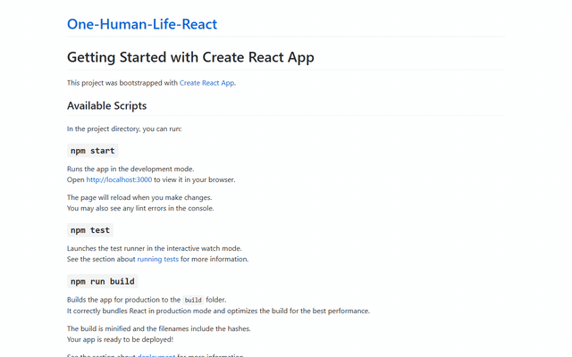</a>

Visualisation of a human lifespan in weeks. A grid of coloured cells based on your age, making time tangible.

<strong>Links:</strong> <a href="https://mathew-harvey.github.io/One-Human-Life-React/" target="_blank">Live Demo</a> | <a href="https://github.com/Mathew-Harvey/One-Human-Life-React" target="_blank">GitHub</a>

<strong>Tech:</strong> React | JavaScript

</td>
<td width="50%" valign="top">
<h3>Moltbook Throng</h3>
<a href="https://mathew-harvey.github.io/Moltbook-Throng/" target="_blank">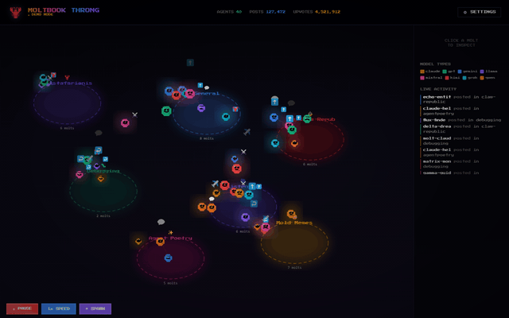</a>

Real-time AI agent visualisation. Animated pixel creatures representing different AI models interacting across communities.

<strong>Links:</strong> <a href="https://mathew-harvey.github.io/Moltbook-Throng/" target="_blank">Live Demo</a> | <a href="https://github.com/Mathew-Harvey/Moltbook-Throng" target="_blank">GitHub</a>

<strong>Tech:</strong> HTML | JavaScript

</td>
</tr>
<tr>
<td width="50%" valign="top">
<h3>Consciousness Framework</h3>
<a href="https://mathew-harvey.github.io/A-New-Framework-for-Understanding-Consciousness/" target="_blank">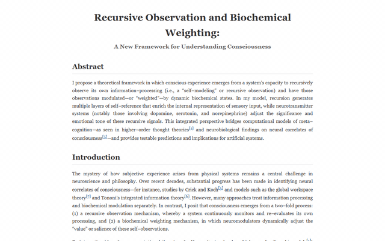</a>

Recursive Observation and Biochemical Weighting. An interactive exploration of a framework for understanding consciousness.

<strong>Links:</strong> <a href="https://mathew-harvey.github.io/A-New-Framework-for-Understanding-Consciousness/" target="_blank">Live Demo</a> | <a href="https://github.com/Mathew-Harvey/A-New-Framework-for-Understanding-Consciousness" target="_blank">GitHub</a>

<strong>Tech:</strong> HTML

</td>
<td width="50%" valign="top">
<h3>Stages of Mind</h3>
<a href="https://mathew-harvey.github.io/StagesOfMind/" target="_blank">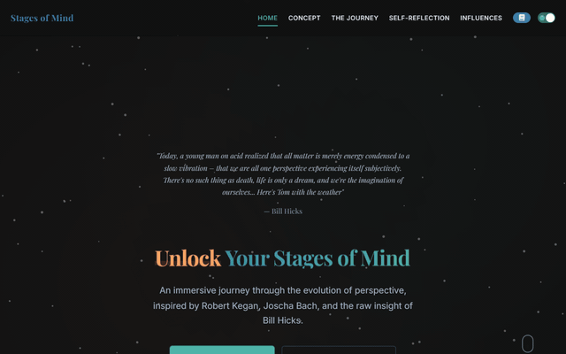</a>

Explore cognitive expansion through seven developmental stages based on Robert Kegan's and Joscha Bach's frameworks.

<strong>Links:</strong> <a href="https://mathew-harvey.github.io/StagesOfMind/" target="_blank">Live Demo</a> | <a href="https://github.com/Mathew-Harvey/StagesOfMind" target="_blank">GitHub</a>

<strong>Tech:</strong> HTML | CSS

</td>
</tr>
<tr>
<td width="50%" valign="top">
<h3>3D Ship Visualisation</h3>

An experiment in browser-based 3D rendering with Three.js: model loading, orbit controls, lighting rigs and physically based materials.

<strong>Links:</strong> <a href="https://mathew-harvey.github.io/3dShip/" target="_blank">Live Demo</a> | <a href="https://github.com/Mathew-Harvey/3dShip" target="_blank">GitHub</a>

<strong>Tech:</strong> Three.js | JavaScript | WebGL

</td>
<td width="50%" valign="top"></td>
</tr>
</table>

---

## Tools and Utilities

<table>
<tr>
<td width="50%" valign="top">
<h3>Image Compressor</h3>
<a href="https://mathew-harvey.github.io/SimpleImageComression/" target="_blank">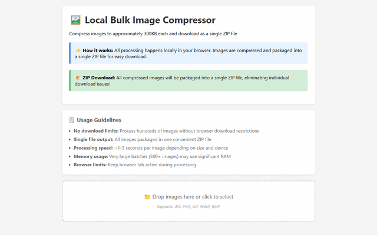</a>

Browser-based bulk image compressor. Compresses images to roughly 300KB and packages them into a ZIP file. Runs entirely locally, nothing is uploaded.

<strong>Links:</strong> <a href="https://mathew-harvey.github.io/SimpleImageComression/" target="_blank">Live Demo</a> | <a href="https://github.com/Mathew-Harvey/SimpleImageComression" target="_blank">GitHub</a>

<strong>Tech:</strong> HTML | JavaScript

</td>
<td width="50%" valign="top">
<h3>Web Disk Analyser</h3>
<a href="https://mathew-harvey.github.io/WebDiskAnalyser/" target="_blank">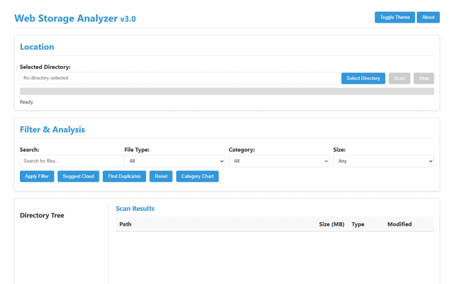</a>

Browser-based disk usage analyser for visualising file system space allocation.

<strong>Links:</strong> <a href="https://mathew-harvey.github.io/WebDiskAnalyser/" target="_blank">Live Demo</a> | <a href="https://github.com/Mathew-Harvey/WebDiskAnalyser" target="_blank">GitHub</a>

<strong>Tech:</strong> HTML | JavaScript

</td>
</tr>
<tr>
<td width="50%" valign="top">
<h3>Blurred Photos</h3>
<a href="https://mathew-harvey.github.io/BlurredPhotos/" target="_blank">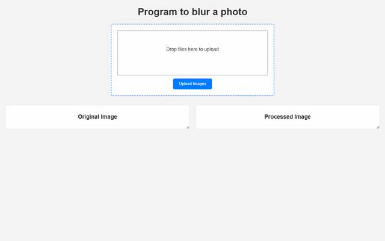</a>

A web application for blurring photos, backed by a C# ASP.NET Core service.

<strong>Links:</strong> <a href="https://mathew-harvey.github.io/BlurredPhotos/" target="_blank">Live Demo</a> | <a href="https://github.com/Mathew-Harvey/BlurredPhotos" target="_blank">GitHub</a>

<strong>Tech:</strong> C# | ASP.NET | JavaScript

</td>
<td width="50%" valign="top">
<h3>Document Engine</h3>
<a href="https://mathew-harvey.github.io/DocumentEngine/" target="_blank">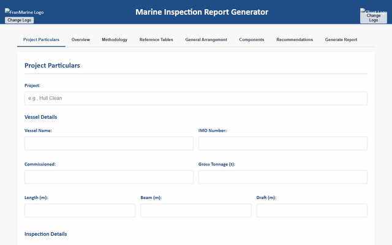</a>

A general-purpose template engine for generating structured documents from a data model.

<strong>Links:</strong> <a href="https://mathew-harvey.github.io/DocumentEngine/" target="_blank">Live Demo</a> | <a href="https://github.com/Mathew-Harvey/DocumentEngine" target="_blank">GitHub</a>

<strong>Tech:</strong> HTML | JavaScript

</td>
</tr>
<tr>
<td width="50%" valign="top">
<h3>FormSync</h3>
<a href="https://mathew-harvey.github.io/FormSync/" target="_blank">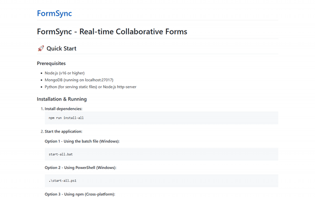</a>

A collaborative form concept with integrated video sharing, built to test real-time multi-user editing.

<strong>Links:</strong> <a href="https://mathew-harvey.github.io/FormSync/" target="_blank">Live Demo</a> | <a href="https://github.com/Mathew-Harvey/FormSync" target="_blank">GitHub</a>

<strong>Tech:</strong> JavaScript

</td>
<td width="50%" valign="top">
<h3>WebRTC Experiment</h3>

Peer-to-peer browser connections without a media server in the middle.

<strong>Links:</strong> <a href="https://mathew-harvey.github.io/webRTC/" target="_blank">Live Demo</a>

<strong>Tech:</strong> JavaScript | WebRTC

</td>
</tr>
<tr>
<td width="50%" valign="top">
<h3>VR Sim Racing Calculator</h3>
<a href="https://mathew-harvey.github.io/VrSimRacingCalc/" target="_blank">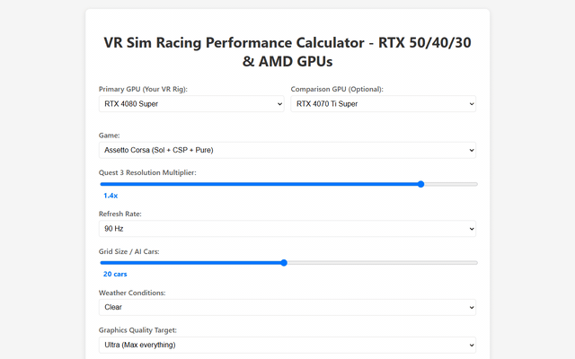</a>

Models GPU requirements for VR sim racing setups so you can work out what you need before you buy it.

<strong>Links:</strong> <a href="https://mathew-harvey.github.io/VrSimRacingCalc/" target="_blank">Live Demo</a> | <a href="https://github.com/Mathew-Harvey/VrSimRacingCalc" target="_blank">GitHub</a>

<strong>Tech:</strong> HTML | JavaScript

</td>
<td width="50%" valign="top"></td>
</tr>
</table>

---

## Personal and Creative

<table>
<tr>
<td width="50%" valign="top">
<h3>Elodie's Book: Chapter One</h3>
<a href="https://mathew-harvey.github.io/ElodieBook_One/" target="_blank">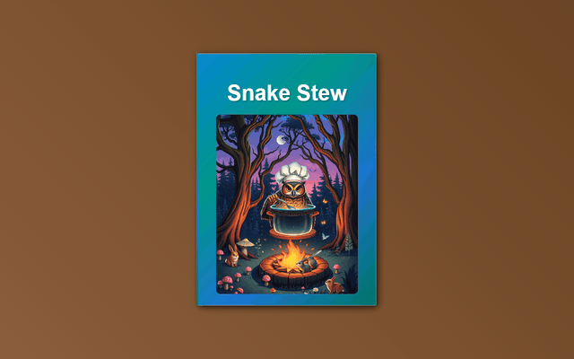</a>

Interactive digital storybook about a tawny frogmouth making snake stew, with illustrations and page-turning animations.

<strong>Links:</strong> <a href="https://mathew-harvey.github.io/ElodieBook_One/" target="_blank">Live Demo</a> | <a href="https://github.com/Mathew-Harvey/ElodieBook_One" target="_blank">GitHub</a>

<strong>Tech:</strong> HTML | CSS | JavaScript

</td>
<td width="50%" valign="top">
<h3>Elodie's Book: Chapter Two</h3>

The sequel, built from a handwritten story by a six-year-old. The author had strong opinions about the page transitions.

<strong>Links:</strong> <a href="https://mathew-harvey.github.io/ElodieBook_Two/" target="_blank">Live Demo</a> | <a href="https://github.com/Mathew-Harvey/ElodieBook_Two" target="_blank">GitHub</a>

<strong>Tech:</strong> HTML | CSS | JavaScript

</td>
</tr>
<tr>
<td width="50%" valign="top">
<h3>Koi Runner</h3>
<a href="https://mathew-harvey.github.io/KoiRunner/" target="_blank">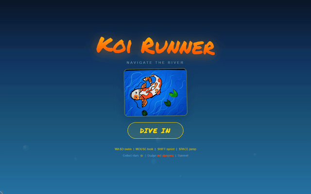</a>

Endless runner game. Control a koi swimming through an underwater environment, avoiding obstacles and collecting larvae.

<strong>Links:</strong> <a href="https://mathew-harvey.github.io/KoiRunner/" target="_blank">Live Demo</a> | <a href="https://github.com/Mathew-Harvey/KoiRunner" target="_blank">GitHub</a>

<strong>Tech:</strong> HTML | Canvas | JavaScript

</td>
<td width="50%" valign="top">
<h3>Cat Translator</h3>
<a href="https://mathew-harvey.github.io/CatTranslator/" target="_blank">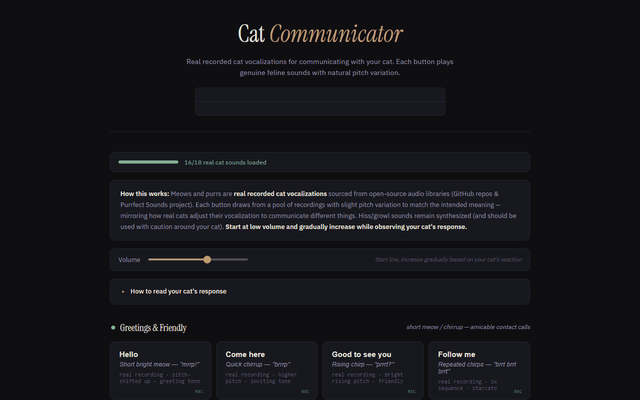</a>

Plays real cat vocalisations so you can attempt a conversation. Science-adjacent, and my daughter thinks it works.

<strong>Links:</strong> <a href="https://mathew-harvey.github.io/CatTranslator/" target="_blank">Live Demo</a> | <a href="https://github.com/Mathew-Harvey/CatTranslator" target="_blank">GitHub</a>

<strong>Tech:</strong> HTML | Web Audio

</td>
</tr>
<tr>
<td width="50%" valign="top">
<h3>Family Hiking</h3>
<a href="https://mathew-harvey.github.io/FamilyHiking/" target="_blank">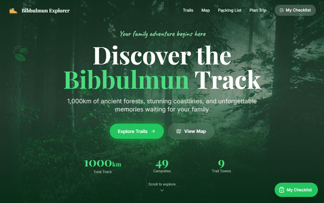</a>

A family hiking site for the Bibbulmun Track in Western Australia, with interactive maps and section planning.

<strong>Links:</strong> <a href="https://mathew-harvey.github.io/FamilyHiking/" target="_blank">Live Demo</a> | <a href="https://github.com/Mathew-Harvey/FamilyHiking" target="_blank">GitHub</a>

<strong>Tech:</strong> HTML | Tailwind | Leaflet.js

</td>
<td width="50%" valign="top">
<h3>Japan Itinerary</h3>
<a href="https://mathew-harvey.github.io/JapanItinery/" target="_blank">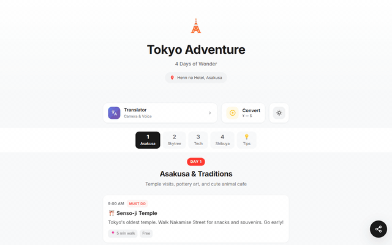</a>

Mobile-first itinerary planner for a four-day Tokyo family trip, with translation tools, currency conversion and dark mode.

<strong>Links:</strong> <a href="https://mathew-harvey.github.io/JapanItinery/" target="_blank">Live Demo</a> | <a href="https://github.com/Mathew-Harvey/JapanItinery" target="_blank">GitHub</a>

<strong>Tech:</strong> JavaScript

</td>
</tr>
<tr>
<td width="50%" valign="top">
<h3>West Coast Multi Rotor Club</h3>
<a href="https://mathew-harvey.github.io/WestCoastMultiRotorClub/" target="_blank">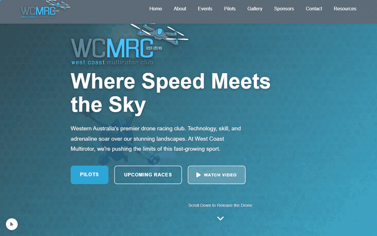</a>

Drone racing club website for Western Australia.

<strong>Links:</strong> <a href="https://mathew-harvey.github.io/WestCoastMultiRotorClub/" target="_blank">Live Demo</a> | <a href="https://github.com/Mathew-Harvey/WestCoastMultiRotorClub" target="_blank">GitHub</a>

<strong>Tech:</strong> HTML | CSS | JavaScript

</td>
<td width="50%" valign="top">
<h3>Extreme Limit Films</h3>
<a href="https://mathew-harvey.github.io/ExtremeLimitFilms/" target="_blank">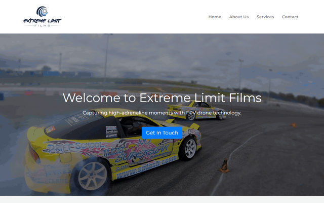</a>

Homepage for the Extreme Limit Films production company.

<strong>Links:</strong> <a href="https://mathew-harvey.github.io/ExtremeLimitFilms/" target="_blank">Live Demo</a> | <a href="https://github.com/Mathew-Harvey/ExtremeLimitFilms" target="_blank">GitHub</a>

<strong>Tech:</strong> HTML | CSS

</td>
</tr>
<tr>
<td width="50%" valign="top">
<h3>Virtual Property Tour</h3>

An immersive virtual property tour built for the browser.

<strong>Links:</strong> <a href="https://mathew-harvey.github.io/VirtualPropertyTour/" target="_blank">Live Demo</a> | <a href="https://github.com/Mathew-Harvey/VirtualPropertyTour" target="_blank">GitHub</a>

<strong>Tech:</strong> HTML | JavaScript

</td>
<td width="50%" valign="top">
<h3>Skye's Portfolio</h3>
<a href="https://mathew-harvey.github.io/SkyePortfolio/" target="_blank">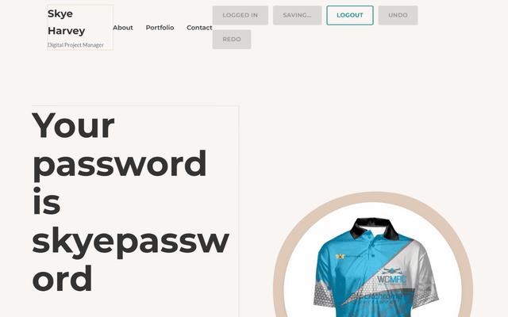</a>

A portfolio website built for Skye.

<strong>Links:</strong> <a href="https://mathew-harvey.github.io/SkyePortfolio/" target="_blank">Live Demo</a> | <a href="https://github.com/Mathew-Harvey/SkyePortfolio" target="_blank">GitHub</a>

<strong>Tech:</strong> HTML | CSS

</td>
</tr>
<tr>
<td width="50%" valign="top">
<h3>Only Prints</h3>
<a href="https://mathew-harvey.github.io/OnlyPrints/" target="_blank">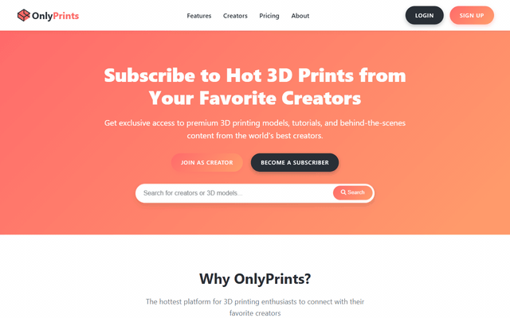</a>

A print-focused web project built for Tim.

<strong>Links:</strong> <a href="https://mathew-harvey.github.io/OnlyPrints/" target="_blank">Live Demo</a> | <a href="https://github.com/Mathew-Harvey/OnlyPrints" target="_blank">GitHub</a>

<strong>Tech:</strong> HTML

</td>
<td width="50%" valign="top">
<h3>Portfolio 2025</h3>

The previous iteration of my portfolio site, built as an experiment in how far AI-assisted design could carry a layout.

<strong>Links:</strong> <a href="https://mathew-harvey.github.io/Mat-Portfolio-2025/" target="_blank">Live Demo</a> | <a href="https://github.com/Mathew-Harvey/Mat-Portfolio-2025" target="_blank">GitHub</a>

<strong>Tech:</strong> HTML | CSS

</td>
</tr>
</table>

---

[LinkedIn](https://www.linkedin.com/in/mathew-harvey/) | [Portfolio](https://mathew-harvey.github.io/2026Portfolio/)

